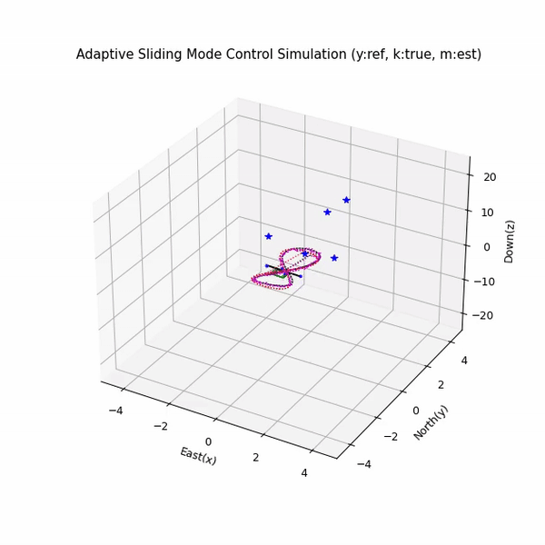
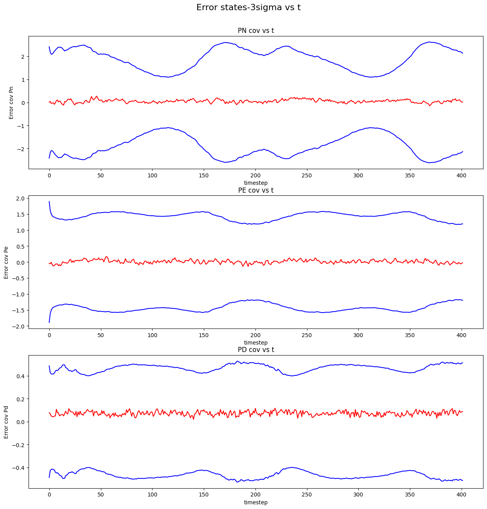
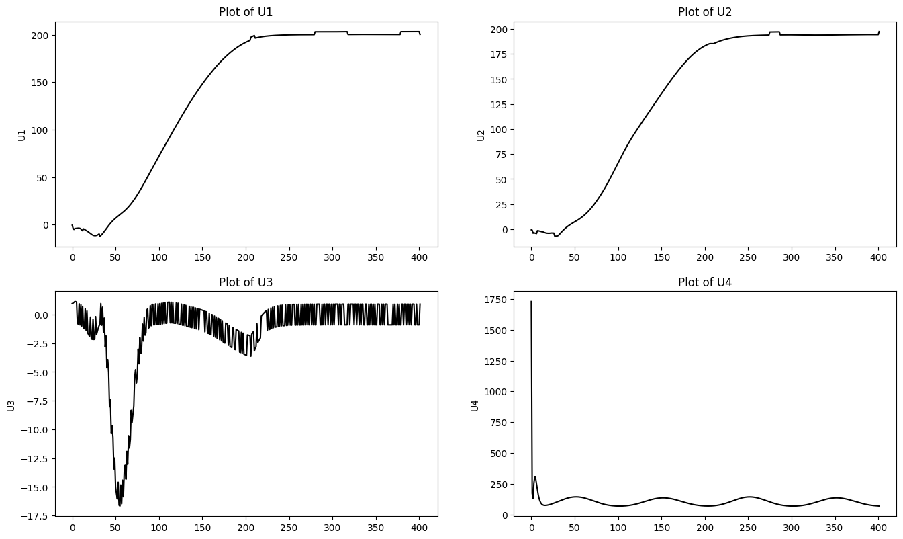

# State Estimation and Robust Control using Kalman Filter and Adaptive Sliding Mode Control

This project demonstrates the integration of a **Kalman Filter** for state estimation and an **Adaptive Sliding Mode Controller (ASMC)** for robust control in the presence of wind disturbances. The system is designed to handle noisy measurements and external disturbances, making it suitable for applications in robotics, autonomous vehicles, and aerospace.

### Key Components:
1. **Kalman Filter**:  
   - Estimates the state of a dynamic system (e.g., position, velocity) based on noisy measurements.  
   - Handles process and measurement noise to provide accurate state estimates.  
   - Visualizes the true state, noisy measurements, and Kalman Filter estimates.  

2. **Adaptive Sliding Mode Controller (ASMC)**:  
   - Provides robust control in the presence of wind disturbances and model uncertainties.  
   - Uses a sliding surface to drive the system state to a desired trajectory.  
   - Adapts to changing conditions (e.g., varying wind disturbances) to maintain stability and performance.  

This project is ideal for those interested in **state estimation**, **robust control**, and **disturbance rejection**, and serves as a practical introduction to advanced control techniques.

## Error Plots and 3-Sigma Bounds  
The following plots show the **error covariance** and **3-sigma bounds** for the estimated states over time. These plots help visualize the performance and uncertainty of the Kalman Filter.

### Error Covariance:
-The error covariance represents the uncertainty in the state estimates (North, East, and Down positions).
-Lower values indicate more accurate estimates, while higher values suggest increased uncertainty.

### 3-Sigma Bounds:
-The 3-sigma bounds define the confidence interval for the estimates. If the error stays within these bounds, the system is performing well.
-These bounds are derived from the Kalman Filter's covariance matrix and reflect the filter's reliability.

### System Performance:
-The plots demonstrate the system's ability to maintain accurate state estimates despite external disturbances (e.g., wind).
-The error remains within the 3-sigma bounds for most of the time, indicating robust performance and reliable state estimation.

## Control Performance Analysis
Plots of control inputs (U1, U2) and system states/outputs (U3, U4) generated by an Adaptive Sliding Mode Controller (ASMC). 
The plots demonstrate the controller's performance in stabilizing the system and tracking desired trajectories.

## **Plots**

-U1: Control input 1 (e.g., thrust or torque for one axis).
-U2: Control input 2 (e.g., torque or thrust for another axis).
-U3: System state/output 1 (e.g., position or velocity).
-U4: System state/output 2 (e.g., another position or velocity).

### **Analysis** 
-U1 and U2: The control inputs are smooth and well-regulated, indicating effective control actions.
-U3: The system state/output follows the desired trajectory, showing good tracking performance.
-U4: The dynamic response suggests active adjustment or convergence of a tracking error.

The ASMC demonstrates strong performance, with smooth control inputs and stable system responses. The system effectively tracks the desired trajectory despite external disturbances.
## Packages Required  
To run this project, you’ll need the following Python packages:  
- `numpy`  
- `matplotlib`  
- `scipy`  

These packages are commonly used for numerical computations, visualization, and scientific computing.

## How to Run  

### 1. Open in Google Colab  
Click the link below to open the notebook directly in Google Colab:  

